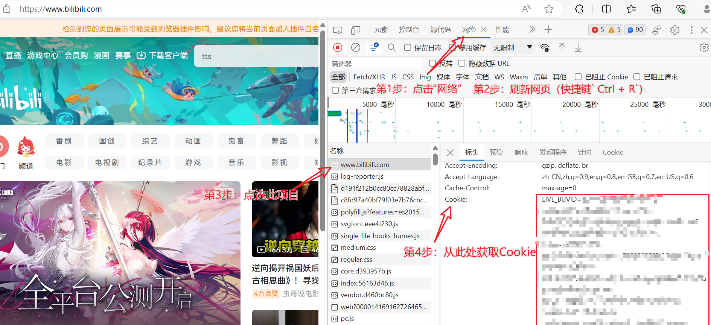

# B站视频下载脚本

> SAST SUMMER 2023, Python Crawler Homework

程序作用：下载给定BV号的B站视频。

## 1. 环境配置
本程序使用 `Python 3.8.13`，引入的第三方库仅包括 `requests 2.27.1`。可以通过如下命令安装所需的第三方库：
```bash
pip install requests
```

## 2. 程序使用
为下载指定BV号的B站视频，用户需给定：视频BV号、视频清晰度以及Cookie文件。本程序通过命令行获取相应的参数，具体使用方法如下：

```bash
# conda anctivate <your_env_name> && 
python main.py [-h] [--bvid BVID] [--qn QN] [--needCookie NEEDCOOKIE]
                [--cookie_path COOKIE_PATH]
```

各个参数的使用说明如下表所示。

| **参数**                      | **使用说明**                             | **默认值**|
|-----------------------------| --------------------------------------|---|
| `-h, --help`                | 显示帮助信息                               ||
| `--bvid BVID`               | 视频的BV号                               |`BV1JQ4y1e7jV` [link](https://www.bilibili.com/video/BV1JQ4y1e7jV/)|
| `--qn QN`                   | 视频清晰度选择                              |80|
| `--needCookie NEEDCOOKIE`   | 是否需要Cookie，1表示需要，0表示不需要              |1|
| `--cookie_path COOKIE_PATH` | Cookie文件的路径 |`Cookie`|

### 2.1 获取BV号
为获取B站视频的BV号，可在网页端直接复制地址栏的地址，得到`https://www.bilibili.com/video/BV1JQ4y1e7jV/*`形式的URL。其中，`https://www.bilibili.com/video/`之后的字符串`BV1JQ4y1e7jV`即为视频BV号。

注意，本程序当前版本尚不支持下载UP主上传视频之外的其他类型的视频，如番剧、电影、直播等。

### 2.2 视频清晰度参数qn使用说明

`qn`参数值与视频清晰度的对应关系如下表所示。

| **`qn`取值** | **视频清晰度** |
|------------|-----------|
| 16         | 360P 流畅   |
| 32         | 480P 清晰   |
| 64         | 720P 高清   |
| 80         | 1080P 高清  |

更多选择请参见 [BAC Document](https://socialsisteryi.github.io/bilibili-API-collect/docs/video/videostream_url.html#qn%E8%A7%86%E9%A2%91%E6%B8%85%E6%99%B0%E5%BA%A6%E6%A0%87%E8%AF%86)。

此程序在本地测试的下载速度在1~2 MB/s，若下载较大的1080P视频可能需要较长时间。

### 2.3 Cookie获取

打开网页版 [Bilibili](https://www.bilibili.com/)（推荐使用Google/Edge/Firefox浏览器），登录B站账号，然后打开开发者工具（快捷键`F12`）。然后，按照下图所示获取Cookie：


获取Cookie后，请将其保存在`cookie_path`参数所指定的路径。默认路径是与Python脚本`main.py`同目录的名为`Cookie`（注意无后缀）的文件。Cookie文件应为**仅包含Cookie的文本文件**。

### 2.4 程序运行结果

运行程序后，如果出现错误，将给出错误信息并安全终止程序。例如，如果你输入了错误的BV号，由于对应的视频不存在，因此程序会给出错误代码-400，并提醒你检查BV号是否正确。

在程序成功运行后，你会得到如下表所示的4个文件：
| **文件名**                       | **说明**   |
|-------------------------------|----------|
| `{bvid}_video.mp4`            | 视频文件     |
| `{bvid}_info.txt`             | 视频信息文件   |
| `{bvid}_front_image.jpg`      | 视频封面图    |
| `{bvid}_onwer_face_image.jpg` | 视频UP主头像图 |

其中，`{bvid}`表示视频的BV号。

例如，直接运行此程序，全部使用默认参数，则我们得到如下的输出文件：
- 视频文件`BV1JQ4y1e7jV_video.mp4`，清华云盘[链接](https://cloud.tsinghua.edu.cn/f/78bea6c2d8e44a3db509/)（密码：`202308100900`）。
- 视频信息文件`BV1JQ4y1e7jV_info.txt`：
```
视频的BVID为 BV1JQ4y1e7jV, AVID为 719626714, 共 1 P, 属于软件应用子分区
 视频标题: 现在贺卡已经进化到这种程度了？别人收到还以为你花钱找别人做的 | Canva 视频编辑教学
 视频简介: 练习档下载 https://share.weiyun.com/eQg7GbBW
 此视频UP主的名字: PAPAYA电脑教室, mid = 402780815
 视频的投稿时间: 2021年12月10日 19时44分42秒
 视频的发稿时间: 2021年12月10日 19时44分42秒
 截至2023年08月10日 08时41分36秒, 本视频5335播放量, 53弹幕, 27评论, 185收藏, 173投币, 34分享, 获341赞
```
- 视频封面图`BV1JQ4y1e7jV_front_image.jpg`

- UP主头像`BV1JQ4y1e7jV_onwer_face_image.jpg`


## 3. 致谢
本程序借助 [BAC Document](https://socialsisteryi.github.io/bilibili-API-collect/) 所整理的API接口获取视频信息与视频下载地址，特此致谢！


## 4. 重要声明
重要的事情说三遍：请勿滥用，本项目仅用于学习和测试！请勿滥用，本项目仅用于学习和测试！请勿滥用，本项目仅用于学习和测试！

